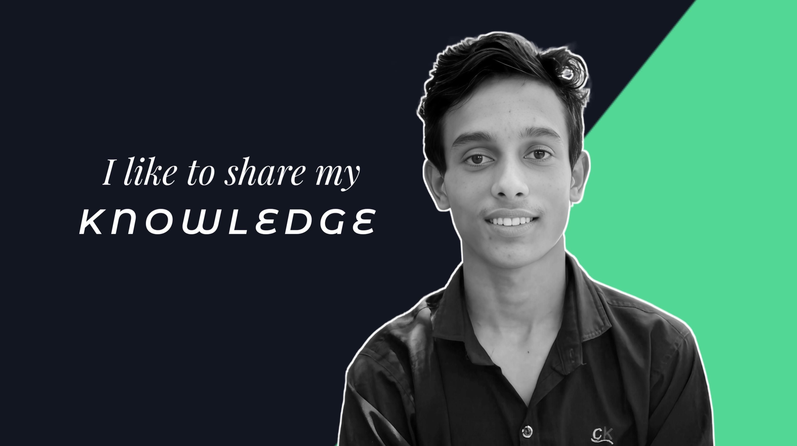
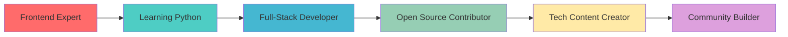

# Hi, I'm Sahin Enam 

<div align="center">
  
</div>

<div align="center">
  
</div>

<p align="center">
  <a href="https://x.com/Sahin_Tech_1?s=09" target="_blank">
    
  </a>
  
  <a href="https://github.com/SahinShazi?tab=followers">
    
  </a>
</p>

---

## 🚀 About Me


I'm a **Frontend Developer** passionate about building modern, responsive websites that make an impact. Skilled in HTML, CSS, JavaScript, and always ready to craft clean code and beautiful UI.

I am passionate about learning and sharing my knowledge with others as publicly as possible. Currently, I'm learning **Python** to expand my skills. I love to solve real-world problems and collaborate on open-source projects.

### 💫 Core Values
<table>
<tr>
<td>👑</td><td><b>Frontend Development</b><br/>Creating beautiful, functional experiences</td>
</tr>
<tr>
<td>🖊️</td><td><b>Clean Code</b><br/>Writing maintainable, elegant solutions</td>
</tr>
<tr>
<td>🎤</td><td><b>Knowledge Sharing</b><br/>Empowering the developer community</td>
</tr>
<tr>
<td>🌱</td><td><b>Continuous Learning</b><br/>Always expanding technical horizons</td>
</tr>
</table>

<br clear="both"/>

---

## 🛠️ Tech Stack & Skills

<div align="center">

### 💻 Frontend Technologies
<p>
  
</p>

### 🔧 Tools & Version Control  
<p>
  
</p>

### 📚 Currently Learning
<p>
  
</p>

</div>

### 👨‍💻 Skill Details

<table align="center">
<tr>
<td align="center" width="50%">

**Frontend Development**
```javascript
const skills = {
  languages: ["JavaScript", "HTML5", "CSS3"],
  frameworks: ["Bootstrap"],
  concepts: ["Responsive Design", "Clean Code"],
  tools: ["Git", "GitHub", "VS Code"]
}
```

</td>
<td align="center" width="50%">

**Currently Expanding**
```python
learning = {
  language: "Python",
  focus: "Full-Stack Development",
  goal: "Backend Integration",
  timeline: "2024"
}
```

</td>
</tr>
</table>

---

## 📊 GitHub Statistics

<div align="center">
  
  
</div>

<div align="center">
  
</div>

<div align="center">
  
</div>

---

## 🏆 Achievement Showcase

<div align="center">

</div>

<div align="center">

</div>


## 📈 Contribution Graph

<div align="center">
  
</div>

---

## 🌐 Connect & Collaborate

<div align="center">

### 🤝 Professional Networks
[](https://t.co/SOrlXs5nQS)
[](https://x.com/Sahin_Tech_1?s=09)
[](https://github.com/SahinShazi)

### 📱 Social Presence  
[](https://www.instagram.com/sahinenam?igsh=MWY2bGlkam1qM2t6YQ==)
[](https://www.facebook.com/share/1Cd7TSsjD6/)

### 🎥 Content Creation
[](https://youtube.com/@sahintechnology?si=azBYE5RM8L7zawUJ)
[](https://www.tiktok.com/@sahinenam?_t=ZS-8yzHEc5owbq&_r=1)

</div>


</div>

---

## 💼 Business Inquiries

<div align="center">
  <h4>📧 Ready to collaborate? Let's build something amazing together!</h4>
  <p>
    <a href="mailto:sahin.enam10@gmail.com">
      
    </a>
  </p>
  <p><strong>✅ sahin.enam10@gmail.com</strong></p>
</div>

---

## 💭 Daily Inspiration

<div align="center">
  
</div>

---

## 🎯 Current Goals & Focus

<div align="center">



</div>

---

## 🔥 Fun Facts

<div align="center">
  
</div>

### 📈 Weekly Development Breakdown
<!--START_SECTION:waka-->
```text
JavaScript   8 hrs 35 mins   ████████████░░░░░░░░░░░░░   48.2%
HTML         4 hrs 12 mins   ██████░░░░░░░░░░░░░░░░░░░   23.6%
CSS          3 hrs 8 mins    ████░░░░░░░░░░░░░░░░░░░░░   17.7%
Python       1 hr 52 mins    ██░░░░░░░░░░░░░░░░░░░░░░░   10.5%
```
<!--END_SECTION:waka-->

---

<div align="center">
  <h2>🌟 "Clean code always looks like it was written by someone who cares" 🌟</h2>
  
  
  
  <p><i>Thanks for visiting my profile! Feel free to explore my repositories and don't forget to ⭐️ star the ones you find interesting!</i></p>
  
   
  <p><em><b>I love connecting with different people</b> so if you want to say <b>hi, I'll be happy to meet you more!</b> 😊</em></p>
  
  <p><sub>💖 Made with passion by <a href="https://github.com/SahinShazi">Sahin Enam</a></sub></p>
</div>