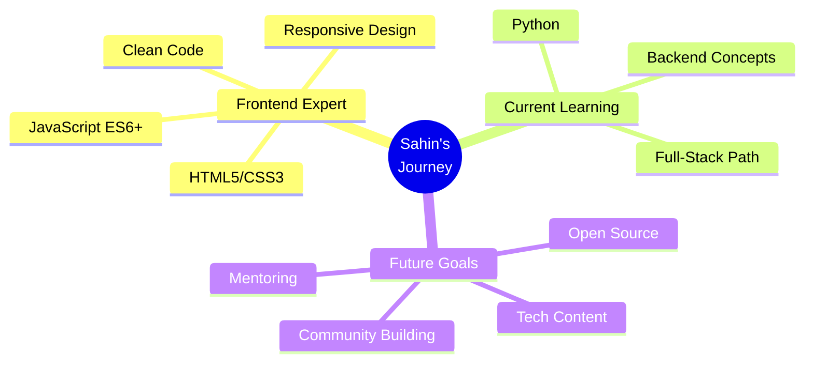

<div align="center">
  
</div>

# </img> Hey there! I'm Sahin Enam

<div align="center">
  
[](https://git.io/typing-svg)


</div>

<table align="center">
<tr>
<td align="center" width="50%">

### 🎯 Quick Stats


[](https://x.com/Sahin_Tech_1?s=09)

[](https://github.com/SahinShazi?tab=followers)

</td>
<td align="center" width="50%">

### ⚡ Current Status
```typescript
const sahin = {
  role: "Frontend Developer",
  location: "Building the web",
  currentFocus: "Python & Clean Code",
  availableFor: "Collaboration"
} as const;
```

</td>
</tr>
</table>


## 🚀 About Me


I'm a **Frontend Developer** passionate about building modern, responsive websites that make an impact. Skilled in HTML, CSS, JavaScript, and always ready to craft clean code and beautiful UI.

I am passionate about learning and sharing my knowledge with others as publicly as possible. Currently, I'm learning **Python** to expand my skills. I love to solve real-world problems and collaborate on open-source projects.

### 💫 Core Values
<table>
<tr>
<td>👑</td><td><b>Frontend Development</b><br/>Creating beautiful, functional experiences</td>
</tr>
<tr>
<td>🖊️</td><td><b>Clean Code</b><br/>Writing maintainable, elegant solutions</td>
</tr>
<tr>
<td>🎤</td><td><b>Knowledge Sharing</b><br/>Empowering the developer community</td>
</tr>
<tr>
<td>🌱</td><td><b>Continuous Learning</b><br/>Always expanding technical horizons</td>
</tr>
</table>

<br clear="both"/>


## 🛠️ Tech Arsenal

<div align="center">

### 🔥 Frontend Mastery


### 🚀 Expanding Horizons


</div>

<div align="center">
<table>
<tr>
<td align="center" width="33%">

**🎨 Frontend**
```javascript
const frontend = {
  languages: ["JavaScript", "HTML5", "CSS3"],
  frameworks: ["Bootstrap"],
  concepts: ["Responsive Design", "UI/UX"],
  level: "Advanced"
};
```

</td>
<td align="center" width="33%">

**🔧 Tools**
```bash
# Development Toolkit
git --version
github --workflow
vscode --extensions
responsive-design --mobile-first
```

</td>
<td align="center" width="33%">

**📈 Learning**
```python
# Current Focus
learning = {
    "language": "Python",
    "goal": "Full-Stack Development",
    "progress": "70%",
    "next": "Backend Integration"
}
```

</td>
</tr>
</table>
</div>


## 📊 GitHub Analytics Dashboard

<div align="center">


</div>

<br/>

<div align="center">

</div>

<br/>

<div align="center">

</div>


## 🏆 Achievement Showcase

<div align="center">

</div>

<div align="center">

</div>


## 🎯 Development Journey

<div align="center">



</div>


## 🌐 Connect & Collaborate

<div align="center">

### 🤝 Professional Networks
[](https://t.co/SOrlXs5nQS)
[](https://x.com/Sahin_Tech_1?s=09)
[](https://github.com/SahinShazi)

### 📱 Social Presence  
[](https://www.instagram.com/sahinenam?igsh=MWY2bGlkam1qM2t6YQ==)
[](https://www.facebook.com/share/1Cd7TSsjD6/)

### 🎥 Content Creation
[](https://youtube.com/@sahintechnology?si=azBYE5RM8L7zawUJ)
[](https://www.tiktok.com/@sahinenam?_t=ZS-8yzHEc5owbq&_r=1)

</div>


## 💼 Business & Collaboration

<div align="center">

<table>
<tr>
<td align="center">

### 📧 Get In Touch
[](mailto:rksahinrone@gmail.com)

**✅ rksahinrone@gmail.com**

*Ready to collaborate? Let's build something amazing together!*

</td>
</tr>
</table>

</div>


## 🎨 Creative Showcase

<div align="center">


<br/><br/>

### 🐍 Contribution Snake
<picture>
  <source media="(prefers-color-scheme: dark)" srcset="https://raw.githubusercontent.com/platane/platane/output/github-contribution-grid-snake-dark.svg">
  <source media="(prefers-color-scheme: light)" srcset="https://raw.githubusercontent.com/platane/platane/output/github-contribution-grid-snake.svg">
  
</picture>

</div>


## 🌟 Fun Interactive Section

<div align="center">

### 🎮 GitHub Stats Game


### 🏅 Coding Streak Challenge


### 📈 Weekly Development Breakdown
<!--START_SECTION:waka-->
```text
JavaScript   8 hrs 35 mins   ████████████░░░░░░░░░░░░░   48.2%
HTML         4 hrs 12 mins   ██████░░░░░░░░░░░░░░░░░░░   23.6%
CSS          3 hrs 8 mins    ████░░░░░░░░░░░░░░░░░░░░░   17.7%
Python       1 hr 52 mins    ██░░░░░░░░░░░░░░░░░░░░░░░   10.5%
```
<!--END_SECTION:waka-->

</div>


## 🎪 Interactive Footer

<div align="center">


### 🌟 Thanks for visiting! 🌟


<br/><br/>

<table align="center">
<tr>
<td align="center">

<br/>
<b>I love connecting with different people</b><br/>
<i>Feel free to say hi, I'll be happy to meet you! 😊</i>
</td>
</tr>
</table>

<br/>


<br/><br/>

*💖 Crafted with passion by [Sahin Enam](https://github.com/SahinShazi)*


</div>